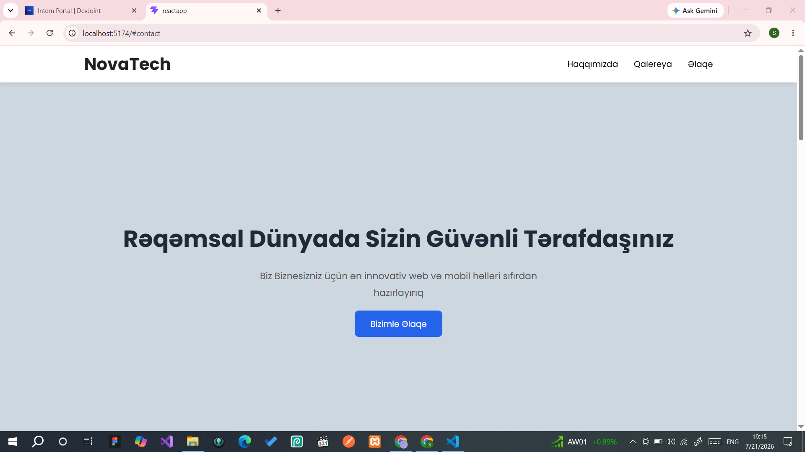
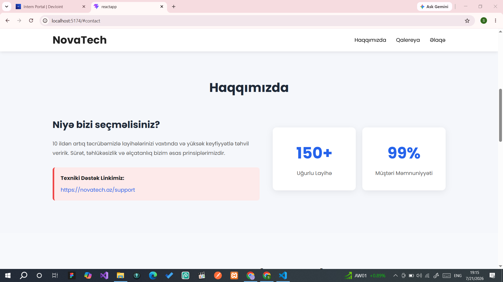
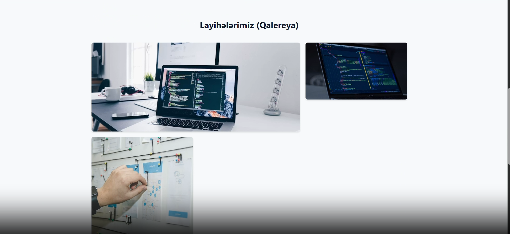
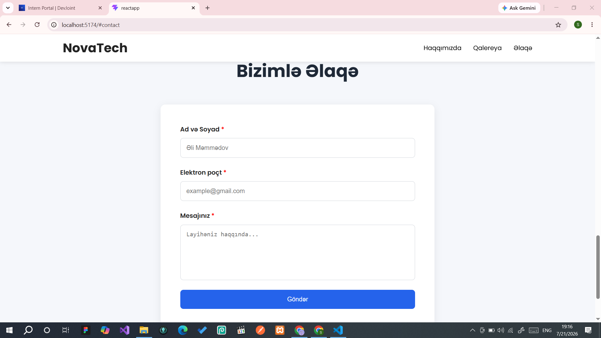

# NovaTech Landing Page

## Layihə haqqında

NovaTech Landing Page React və Vite istifadə edilərək hazırlanmış responsiv veb səhifədir. Layihədə semantik HTML, Flexbox, CSS Grid, JavaScript və React istifadə olunmuşdur.

## İstifadə olunan texnologiyalar

- React
- Vite
- HTML5
- CSS3
- JavaScript (ES6)

## Xüsusiyyətlər

- Responsive dizayn (Mobile, Tablet, Desktop)
- Semantik HTML
- Hamburger menyu
- Smooth Scroll
- Əlaqə formu
- Client-side Validation
- Accessibility (ARIA, label, alt və s.)

## Layihənin quraşdırılması

1. Repository-ni klonlayın:

```bash
git clone https://github.com/username/novatech-landing-page.git
```

2. Layihə qovluğuna keçin:

```bash
cd novatech-landing-page
```

3. Lazımi paketləri quraşdırın:

```bash
npm install
```

4. Layihəni işə salın:

```bash
npm run dev
```

## Ekran görüntüləri
### Home



### About



### Gallery



### Contact


